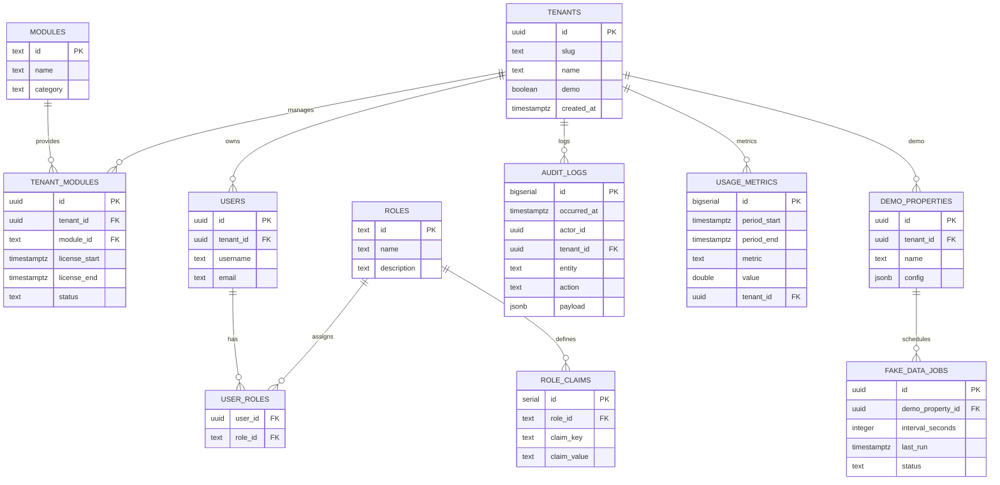

```markdown
# Nexefii Database Blueprint — Multi-tenant, Module-ready (PostgreSQL)

Generated: 2025-11-12

## Overview

This blueprint targets a single PostgreSQL database with a schema-per-tenant strategy and a `public` (master) schema for registry, control and shared metadata. It is designed to support modular verticals (PMS, CMS, BMS, EMS) while providing strong tenant isolation, efficient time-series partitioning for audit and metrics, and robust RBAC.

Key goals:
- Tenant isolation via per-tenant schemas (ease of backup/restore, per-tenant migrations)
- Shared registry in `public` (tenants, modules, module registry)
- Time-partitioned audit_logs and usage_metrics (monthly) for scale
- Clear naming conventions and FK/index strategies

## Rationale: Schema-per-tenant vs DB-per-tenant

- Schema-per-tenant (recommended):
  - Pros: Easier multi-tenant queries for cross-tenant analytics; single connection pool; simpler ops than many DBs; cheaper for cloud managed DBs. Allows per-tenant schema-level permissions and per-tenant table creation.
  - Cons: Slightly more complex to guarantee absolute isolation vs separate DBs; table object count grows with number of tenants.

- DB-per-tenant:
  - Pros: Stronger isolation (OS-level), easy per-tenant backup/restore, easier to throttle per-tenant resources.
  - Cons: Operational overhead (many DBs), higher cost on managed DB platforms, more complex cross-tenant analytics.

Recommendation: Start with schema-per-tenant for v0.0 for operational simplicity and cost-effectiveness. If a tenant requires strict isolation, allow migration to dedicated DB later.

## Naming conventions

- All names use snake_case
- Primary keys: pk_<table> (e.g., pk_tenants)
- Foreign keys: fk_<from>__<to> (e.g., fk_users__tenants)
- Indexes: idx_<table>__<cols> (e.g., idx_audit_logs__occurred_at)
- Partition tables: <parent>_p_YYYYMM (e.g., audit_logs_p_202511)

## ERD (Mermaid)



## Tables spec (DDL-level)

- See migrations in `/sprints/sprint-8/outputs/migrations/` for full DDL. Important choices:
  - `tenants.id` is UUID (gen_random_uuid())
  - `audit_logs` and `usage_metrics` are partitioned by range on `occurred_at`/`period_start` respectively; partitions named `*_p_YYYYMM`.
  - Indexing: common indexes on tenant_id, occurred_at/period_start, actor_id, and composite indexes where appropriate.
  - Foreign keys use ON DELETE CASCADE for tenant-owned resources (users, demo_properties), but audit_logs preserve history (NO cascade) — audit_logs.tenant_id is FK WITHOUT cascade to avoid accidental data loss.

## Partition & Index strategy

- Partition audit_logs and usage_metrics monthly to support high-ingest workloads and easy retention.
- Create indexes on parent tables to support planning but create indexes on partitions as needed. Use BRIN for very large timestamped tables if needed.
- Use pg_partman or simple scheduled `rotate_partitions()` function to create next partitions.

## Security & RBAC

- `users` table holds hashed password (bcrypt) and `roles` assigned via `user_roles`.
- Role claims table (role_claims) contains granular permissions; tokens should embed tenantId and role claims.
- Use schema-level ownership and search_path settings in tenant-specific connections to minimize accidental cross-tenant access.

## Migration Plan

- Migrations provided: V001__init.sql (schema + partitioning), V002__seed.sql (seed modules & demo tenant & partitions), V003__demo.sql (example demo tenant schema and sample data).
- Use Flyway or similar to apply migrations in order. Each migration is idempotent where reasonable.

## Appendices
- See `/sprints/sprint-8/outputs/migrations/` for SQL and `/sprints/sprint-8/outputs/qa/` for schema-lint script and ERD export note.

```
