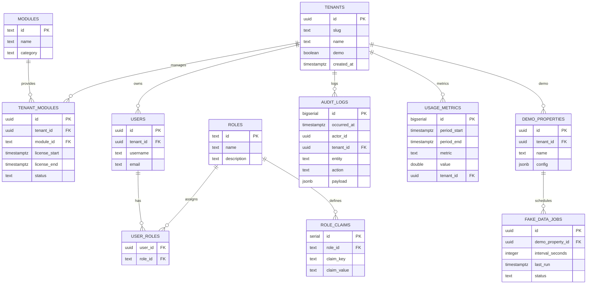

````markdown
Copy the Mermaid ERD block below into diagrams.net or Mermaid live editor to export the ERD as an image.


```mermaid
erDiagram
    TENANTS ||--o{ TENANT_MODULES : manages
    MODULES ||--o{ TENANT_MODULES : provides
    TENANTS ||--o{ USERS : owns
    ROLES ||--o{ USER_ROLES : assigns
    USERS ||--o{ USER_ROLES : has
    ROLES ||--o{ ROLE_CLAIMS : defines
    TENANTS ||--o{ AUDIT_LOGS : logs
    TENANTS ||--o{ USAGE_METRICS : metrics
    TENANTS ||--o{ DEMO_PROPERTIES : demo
    DEMO_PROPERTIES ||--o{ FAKE_DATA_JOBS : schedules

    TENANTS {
      uuid id PK
      text slug
      text name
      boolean demo
      timestamptz created_at
    }
    MODULES {
      text id PK
      text name
      text category
    }
    TENANT_MODULES {
      uuid id PK
      uuid tenant_id FK
      text module_id FK
      timestamptz license_start
      timestamptz license_end
      text status
    }
    USERS {
      uuid id PK
      uuid tenant_id FK
      text username
      text email
    }
    ROLES {
      text id PK
      text name
      text description
    }
    USER_ROLES {
      uuid user_id FK
      text role_id FK
    }
    ROLE_CLAIMS {
      serial id PK
      text role_id FK
      text claim_key
      text claim_value
    }
    AUDIT_LOGS {
      bigserial id PK
      timestamptz occurred_at
      uuid actor_id
      uuid tenant_id FK
      text entity
      text action
      jsonb payload
    }
    USAGE_METRICS {
      bigserial id PK
      timestamptz period_start
      timestamptz period_end
      text metric
      double value
      uuid tenant_id FK
    }
    DEMO_PROPERTIES {
      uuid id PK
      uuid tenant_id FK
      text name
      jsonb config
    }
    FAKE_DATA_JOBS {
      uuid id PK
      uuid demo_property_id FK
      integer interval_seconds
      timestamptz last_run
      text status
    }
```

````
